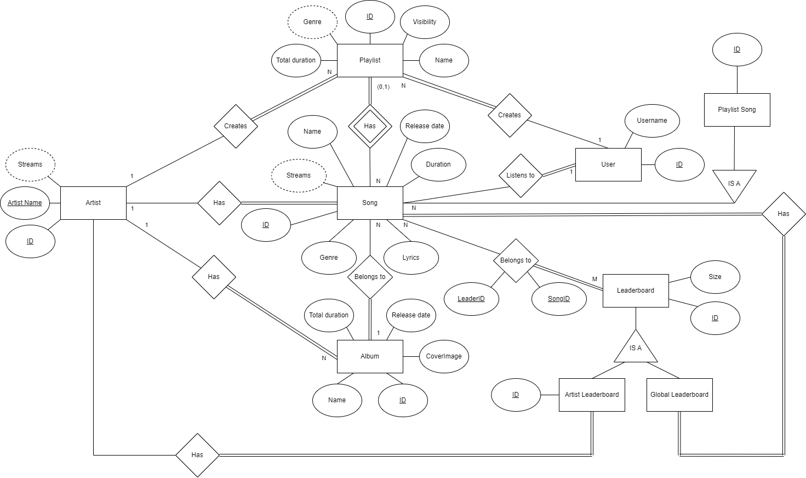
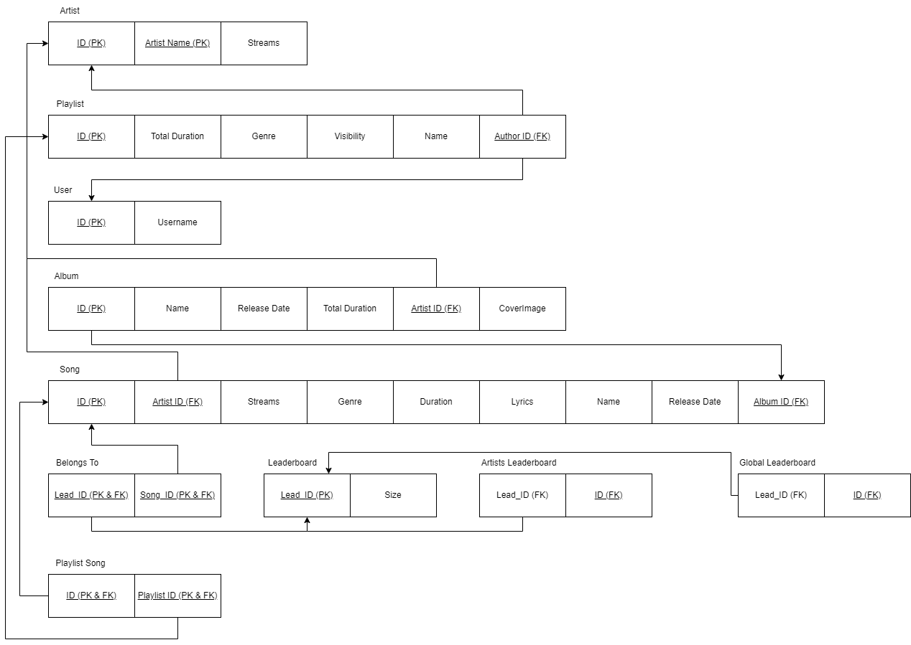

# BD: Trabalho Prático APF-T

**Grupo**: P4G6
- Diogo Fernandes, MEC: 114137
- Raquel Vinagre, MEC: 113736

## Introdução / Introduction
 
Este projeto consiste numa base de dados para uma plataforma de streaming digital de música, de modo a gerir utilizadores, playlists, músicas, artistas e álbuns. A nossa escolha foi motivada pelo nosso interesse mútuo na área da música e na versatilidade que disponibiliza para um projeto deste tipo. 

Como em qualquer plataforma de streaming de música, os utilizadores podem ouvir músicas adicionadas pelos artistas. É possível, ainda, criar/editar playlists personalizadas, criar/editar álbuns, verificar as leaderboards globais e ainda algumas estatísticas.

A interface foi desenvolvida para o uso administrativo (todas as permissões), de modo a demonstrar todas as features implementadas, quer sejam de artista ou utilizador.

## ​Análise de Requisitos / Requirements

Adicionar/editar/remover músicas
Adicionar/editar/remover álbuns
Criar/editar/remover artistas
Criar/editar/remover playlists
Procurar/filtrar info sobre artista/álbum/música/playlists
Ouvir e favoritar músicas
Leaderboards
Estatísticas

## DER - Diagrama Entidade Relacionamento/Entity Relationship Diagram

### Versão final/Final version



### APFE 

Descreva sumariamente as melhorias sobre a primeira entrega.

Foi criada a entidade PlaylistSong (com ID da playlist e da música), que foi necessária para adicionar músicas a playlists. Como uma música pode pertencer a mais do que uma playlist, o processo não poderia ser o mesmo que o de adicionar músicas a álbuns (consistia em mudar o ID do álbum como atributo da música para o ID do álbum a que pertença, isto resulta pois uma música só pode pertencer a 0 ou 1 álbuns). 

Agora está especificado que a Global Leaderboard apenas contém músicas.

## ER - Esquema Relacional/Relational Schema

### Versão final/Final Version



### APFE

Descreva sumariamente as melhorias sobre a primeira entrega.

As alterações correspondem às anteriores mencionadas.

## ​SQL DDL - Data Definition Language

[SQL DDL File](../sql/01_ddl.sql "SQLFileQuestion")

## SQL DML - Data Manipulation Language

Uma secção por formulário.
A section for each form.

### Formulario Song


```sql
-- Show data on the form
SELECT Name, Genre, ReleaseDate, Duration, ArtistID, Lyrics FROM Song WHERE ID = @SongID;

-- Insert new element
INSERT INTO Song (ArtistID, Streams, Genre, Duration, Lyrics, Name, ReleaseDate, AlbumID) VALUES 
(@ArtistID, @Streams, @Genre, @Duration, @Lyrics, @Name, @ReleaseDate, @AlbumID);

```

### Formulario Album


```sql
-- Show data on the form
SELECT Name, ReleaseDate, TotalDuration, ArtistID FROM Album WHERE ID = @AlbumID;

-- Insert new element
INSERT INTO Album (Name, ReleaseDate, TotalDuration, ArtistID) VALUES 
(@Name, @ReleaseDate, @TotalDuration, @ArtistID);

```

### Formulario Artist


```sql
-- Show data on the form
SELECT ArtistName FROM Artist WHERE ID = @ArtistID;

-- Insert new element
INSERT INTO Artist (ArtistName) VALUES (@ArtistName);
```

### Formulario Playlist


```sql
-- Show data on the form
SELECT Name, Genre, Visibility, TotalDuration, AuthorID FROM Playlist WHERE ID = @PlaylistID;

-- Insert new element
INSERT INTO Playlist (TotalDuration, Genre, Visibility, Name, AuthorID) VALUES 
(@TotalDuration, @Genre, @Visibility, @Name, @AuthorID);

```

## Normalização/Normalization

Descreva os passos utilizados para minimizar a duplicação de dados / redução de espaço.

Não foi necessário recorrer a normalização, pois todas as tabelas já se encontravam normalizadas.

## Índices/Indexes

Descreva os indices criados. Junte uma cópia do SQL de criação do indice.

Os índices criados foram os seguintes:

- Índice na Song table para o ArtistID
- Índice na Album table para o ArtistID


```sql
-- Create an index to speed

IF EXISTS (SELECT name FROM sys.indexes WHERE name = 'idx_Song_ArtistID')
BEGIN
    DROP INDEX idx_Song_ArtistID ON Song;
END
CREATE INDEX idx_Song_ArtistID ON Song (ArtistID);


IF EXISTS (SELECT name FROM sys.indexes WHERE name = 'idx_Album_ArtistID')
BEGIN
    DROP INDEX idx_Album_ArtistID ON Album;
END
CREATE INDEX idx_Album_ArtistID ON Album (ArtistID);

```

## SQL Programming: Stored Procedures, Triggers, UDF

[SQL SPs and Functions File](../sql/02_sp_functions.sql "SQLFileQuestion")

[SQL Triggers File](../sql/03_triggers.sql "SQLFileQuestion")

[SQL Views File](../sql/02_views.sql "SQLFileQuestion")

## Outras notas/Other notes

### Dados iniciais da base de dados/Database init data

[Indexes File](../sql/05_Indexes.sql "SQLFileQuestion")


 
